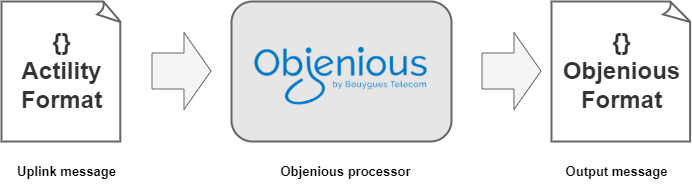
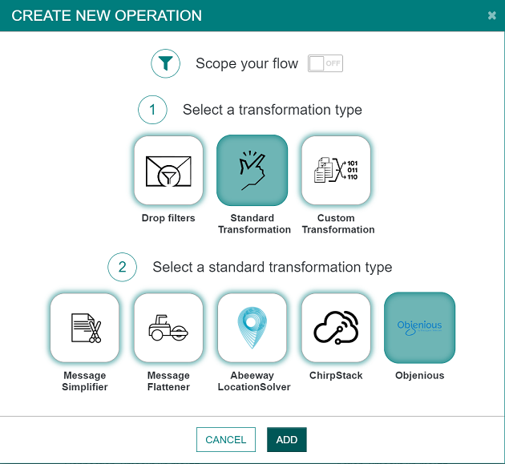

# Objenious

* Objenious is the LoRaWAN networks managed by Bouygues Telecom.

We use a standard output transformation processor that transform output messages from Actility's format to [Objenious uplink type](https://api.objenious.com/doc/doc-routing.html).



We transform Uplink message described [here](./../../Message/Uplink_Message).

On your connection, inside the "Uplink transformations" panel, you can add an operation that do the transformation.


## Uplink message
### Input Uplink message

A simplified input uplink message could be similar to this:

```json
{
  "DevEUI_uplink": {
    "Time": "2023-03-01T00:00:11.013+01:00",
    "DevEUI": "402C765000000074",
    "FPort": 2,
    "FCntUp": 53,
    "ADRbit": 1,
    "MType": 4,
    "FCntDn": 54,
    "payload_hex": "02300040a0",
    "mic_hex": "61fa24cf",
    "Lrcid": "00000127",
    "LrrRSSI": -83.0,
    "LrrSNR": 9.5,
    "LrrESP": -83.461838,
    "SpFact": 7,
    "SubBand": "G0",
    "Channel": "LC1",
    "DevLrrCnt": 2,
    "Lrrid": "3C200E92",
    "Late": 0,
    "LrrLAT": 48.933865,
    "LrrLON": 1.195898,
    "Lrrs": {
      "Lrr": [
        {
          "Lrrid": "3C200E92",
          "Chain": 0,
          "LrrRSSI": -83.0,
          "LrrSNR": 9.5,
          "LrrESP": -83.461838
        },
        {
          "Lrrid": "1000027C",
          "Chain": 0,
          "LrrRSSI": -89.0,
          "LrrSNR": 6.75,
          "LrrESP": -89.832695
        }
      ]
    },
    "CustomerID": "100133870",
    "CustomerData": {
      "alr": {
        "pro": "LORA/Generic",
        "ver": "1"
      },
      "tags": [
        "site=Paris"
      ],
      "name": "My Demo Device"
    },
    "DriverCfg": {
      "app": {
        "pId": "actility",
        "mId": "demo",
        "ver": "1"
      }
    },
    "InstantPER": 0.0,
    "MeanPER": 0.0,
    "DevAddr": "04D2848E",
    "AckRequested": 1,
    "TxPower": 2.0,
    "NbTrans": 1,
    "Frequency": 868.1,
    "DynamicClass": "A",
    "payload": {
      "battery": {
        "type": "tension",
        "value": 3.6,
        "unit": "V",
        "error": 0
      }
    }
  }
}
```

### Output Uplink message

The output of the processor follows the [Objenious uplink type](https://api.objenious.com/doc/doc-routing.html):

```json
{
  "id" : "f48274cc-766e-43b4-9fa7-941d40ef1454",
  "device_id" : "402C765000000074",
  "type" : "uplink",
  "timestamp" : "2023-03-01T00:00:11.013+01:00",
  "count" : 53,
  "payload_cleartext" : "02300040a0",
  "payload" : {
    "battery" : {
      "type" : "tension",
      "value" : 3.6,
      "unit" : "V",
      "error" : 0
    }
  },
  "device_properties" : {
    "deveui" : "402C765000000074"
  },
  "protocol_data" : {
    "DevAddr" : "04D2848E",
    "NetID" : "3C200E92",
    "best_gateway_id" : "3C200E92",
    "gateways" : 2,
    "noise" : -93.41392685158225,
    "port" : 2,
    "requested_nbrep" : 1,
    "rssi" : -83.0,
    "sf" : 7,
    "signal" : -83.461838,
    "snr" : 9.5
  }
}
```
