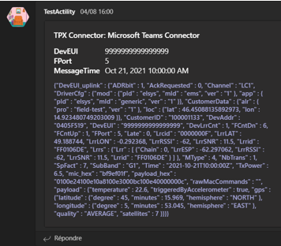
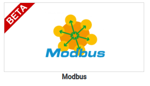

# TPX-IoT-Flow 1.6.X
## 1.6.22c

### MAJOR BUGS RESOLVED

| JIRA Ticket | Description |
| ----------- | ----------- |
| ```TXIF-2577``` | Thingworx QueryImplementingThingsOptimized optimization. |

## 1.6.21

### MAJOR BUGS RESOLVED

| JIRA Ticket | Description |
| ----------- | ----------- |
| ```TXIF-2150``` | OPCUA Issue when retreiving Devices. |
| ```TXIF-2084``` | Thingworx should support derived template. |

## 1.6.20

### MAJOR BUGS RESOLVED

| JIRA Ticket | Description |
| ----------- | ----------- |
| ```TXIF-2068``` | TPX-UI : Logo customization : Operator logo not used. |

## 1.6.19

### MAJOR BUGS RESOLVED

| JIRA Ticket | Description |
| ----------- | ----------- |
| ```TXIF-2035``` |  Advantech username/password fields validation failed. |

## 1.6.18

### NEW FEATURES RELEASED

| JIRA Ticket | Description |
| ----------- | ----------- |
| ```TXIF-1998``` | Add prometheus metrics to monitor the Driver Engine. |
| ```TXIF-1922``` | Driver engine must not reload a driver already loaded. |
| ```TXIF-1907``` | Support LoRa Alliance Driver Signature. |
| ```TXIF-1998``` | Driver engine consumes too many RAM during the driver injection phase. |

## 1.6.17

### MAJOR BUGS RESOLVED

| JIRA Ticket | Description |
| ----------- | ----------- |
| ```TXIF-1969``` | Thingsboard REST Client giving 401 Unauthorized at login. |

## 1.6.16

### NEW FEATURES RELEASED

| JIRA Ticket | Description |
| ----------- | ----------- |
| ```TXIF-1986``` | Advantech connector on  TPE OCP. |

### MAJOR BUGS RESOLVED

| JIRA Ticket | Description |
| ----------- | ----------- |
| ```TXIF-1981``` | Azure IoT-HUB instability. |

## 1.6.14

### MAJOR BUGS RESOLVED

| JIRA Ticket | Description |
| ----------- | ----------- |
| ```TXIF-1970``` | Support multiple hub on Azure IoT Central. |
| ```TXIF-1966``` | Unmodeled data on first abeeway device on IoT Central. |
| ```TXIF-1964``` | Too many API call GET /api/deviceTemplates in IoT Central. |

## 1.6.13

### NEW FEATURES RELEASED

| JIRA Ticket | Description |
| ----------- | ----------- |
| ```TXIF-1951``` | Chain connector improvement. |
| ```TXIF-1939``` | Advantech connector. |

### MAJOR BUGS RESOLVED

| JIRA Ticket | Description |
| ----------- | ----------- |
| ```TXIF-1957``` | Azure IoT Central timeout to open link is not sufficient. |
| ```TXIF-1948``` | Azure Open-File + CPU Issue. |
| ```TXIF-1947``` | Check device ID when loading registered devices in IoT Central. |
| ```TXIF-1945``` | Can't receive uplinks using Teams connection and chirpstack transformation. |

## 1.6.12

### MAJOR BUGS RESOLVED

| JIRA Ticket | Description |
| ----------- | ----------- |
| ```TXIF-1933``` | IoT-Central Fix telemetry issue |

## 1.6.11

### MAJOR BUGS RESOLVED

| JIRA Ticket | Description |
| ----------- | ----------- |
| ```TXIF-1926``` | Unable to update driver with ChirpStack signature |
| ```TXIF-1927``` | Issue with ChirpStack mapping |

## 1.6.10

### MAJOR BUGS RESOLVED

| JIRA Ticket | Description |
| ----------- | ----------- |
| ```TXIF-1912``` | Unable to register Abeeway devices from LocationEngine |

## 1.6.8a

### MAJOR BUGS RESOLVED

| JIRA Ticket | Description |
| ----------- | ----------- |
| ```TXIF-1802``` | Thingworx connector limited to 500 devices. <a href="https://www.ptc.com/en/support/article/CS290970">GetImplementingThings() Service for ThingTemplate and ThingShape only returns 500 rows in ThingWorx Composer.</a> |

## 1.6.8

### MAJOR BUGS RESOLVED

| JIRA Ticket | Description |
| ----------- | ----------- |
| ```TXIF-1802``` | Memory leak on RestTemplate SpringBoot component. <a href="https://github.com/spring-projects/spring-boot/issues/25860">Potential memory leak in MetricsClientHttpRequestInterceptor.</a> |

## 1.6.7

### NEW FEATURES RELEASED

| JIRA Ticket | Description |
| ----------- | ----------- |
| ```TXIF-1843``` | Thingboard support of DeviceType autocreation |
| ```TXIF-1842``` | ThingBoard UI rework |
| ```TXIF-1834``` | downlinkAsId field available on TPX UI |
| ```TXIF-1780``` / ```TXIF-1770``` | MQTT connector : ClientId could be customized |

### MAJOR BUGS RESOLVED

| JIRA Ticket | Description |
| ----------- | ----------- |
| ```TXIF-1817``` | IoT-Central connection don't start if no template available |
| ```TXIF-1844``` | Thingboard Connector refactoring |
| ```TXIF-1838``` | Points schema inject when creating custom driver |
| ```TXIF-1832``` | Better display of running version on swagger |
| ```TXIF-1829``` | The hub does not send error to the connection when service unavailable |
| ```TXIF-1826``` | Forward pointsSchema when duplicating/overriding system driver |
| ```TXIF-1822``` | HTTP uplink metric success / failed |
| ```TXIF-1814``` | Actility logo appears before being replaced by white mark logo. |
| ```TXIF-1804``` | AWS don't support fields with dash like "Axis-Y" |
| ```TXIF-1801``` | Cumulocity Connector : Location does not update |
| ```TXIF-1798``` | Add fields to ontology |
| ```TXIF-1794``` | Cannot register a device on Cumulocity after deleting it |
| ```TXIF-1786``` | Source is not defined when system driver but not actility |
| ```TXIF-1783``` | Error when deleting a custom driver with duplicated id |
| ```TXIF-1779``` | Cumulocity notification not received |
| ```TXIF-1776``` | Azure slow startup |
| ```TXIF-1642``` | Downlink counter seem's not work on HTTP connector. |

## 1.6.6

### MAJOR BUGS RESOLVED

* Connections taking time to restart properly,
* Cumulocity connector : CPU usage fix + full support of drivers with ontology,
* Azure IoT-Hub downstream management improvements to prevent disconnections.

## 1.6.1

### NEW FEATURES RELEASED

#### Ginjer

This new connector enables devices to use the <a href="https://www.ginjer.io"> Ginjer application platform</a>.


Documentation can be found on <a href="https://docs.thingpark.com/thingpark-x/latest/Connector/GINJER/">the ThingPark Connectors documentation</a>.

#### Azure Event Hubs

This new connector enables sending uplinks to Azure Event Hubs without using Azure IoT Hub.


#### Microsoft Teams

This new connector enables sending uplinks to Microsoft Teams. The user needs to provide its Webhook and the uplinks are displayed on its channel.




#### Modbus (OCP only)

This new connector enables use of Modbus by implementing an embedded Modbus slave, collecting uplinks and mapping application payload values to registers according to the configured rules. (TXIF-1051)



Documentation can be found <a href="https://docs.thingpark.com/thingpark-x/latest/Connector/MODBUS/">here</a>

#### OPC UA (OCP only)

This new connector enables use of OPC UA by implementing an embedded OPC UA server, collecting uplinks and mapping application payload values to the configured registers. Device and gateway status are also exposed on this OCP UA server. (TXIF-1312)


Documentation can be found <a href="https://docs.thingpark.com/thingpark-x/latest/Connector/OPCUA/">here</a>

#### ThingsBoard

This new connector enables devices to se the ThingsBoard.io application platform. (TXIF-1347)


### Updated connectors

#### Here

* Here Connector is improved with the support of Bluetooth mapping. (TXIF-1526)

* The AppID can also be specified if the user has multiples projects on its HERE account.


Documentation can be found <a href="https://docs.thingpark.com/thingpark-x/latest/Connector/HERE/">here</a>

#### Azure IoT Hub

Azure IoT Hub has a mutual exclusion mechanism for downstream. 

If more than one client try to establish a link on a device, user cannot access to this link. TPX now provides the solution for disabling downstream links. Be aware that the user cannot receive the downlinks this option is used. (TXIF-1350)

#### Azure IoT-Central

* ```deviceTemplateId``` and ```pricingPlan``` fields are removed. (TXIF-1319)

* Device template loading time is improved for supporting complex templates. (TXIF-1177)

#### AWS IoT Core

* Following AWS recommandations, TPX internal connectivity with AWS IoT Core is migrated from MQTT to HTTPS for the uplinks. An MQTT link still exists for receiving the downlinks. (TXIF-1173)

* Proxy support is added. (TXIF-1437)

#### MQTT

* Advanced Settings now contain a set of parameters for a fine-tuning the  use of MQTT Broker. (TXIF-1324 / TXIF-1407 / TXIF-1413)


* Documentation can be found <a href="https://docs.thingpark.com/thingpark-x/latest/Connector/MQTT/">here</a>

#### Cumulocity

* Unused fields (``agentId`` + ``deviceType``) are deleted on the Cumulocity Connector. (TXIF-1615)`

* The following field from TPX ontology are now mapped to the Cumulocity Ontology: ``temperature``, ``batteryLevel``, ``humidity``, ``speed``, ``acceleration``, ``distance``, ``light``, ``power``, ``batteryVoltage``, ``current``, ``location``, ``pressure``, ``motion``, ``co2Level``. (TXIF-1580)

#### HTTP

* Proxy support is added. (TXIF-1437)

* UI support to send downlink is added. (TXIF-1348)


* Endpoint for HTTP Downlink messages is exposed on your HTTP connector. (TXIF-1315)


### Common connector changes

* Basics connectors that were initially developed based on the DX-Dataflow now supports the legacy options on the UI.

For details, see the ``sendMetadata`` on the common properties section in <a href="https://docs.thingpark.com/thingpark-x/latest/Getting%20started/Setting%20Up%20A%20Connection%20instance/About_connections#common-parameters">the public documentation</a>.  (TXIF-1413)

* Added ``sendRawDecodedFormat`` on MQTT / AWS IoT Core / HTTP / Azure IoT Core which enables delivery of only the decoded payload and not the whole uplink message. (TXIF-1403)

* Created a new message processor to transform the message to the flat format that allows single level of fields. (TXIF-1425)


* Events are made available on UI. (TXIF-1267)


* A deletion button is added to the connections list. (TXIF-1409)


* Provided support for Hub and Bridge to continue processing messages even when the SQL database is down. (TXIF-751)

### Drivers

* Added an indication and disabled the override feature for the private drivers. (TXIF-1522)


* Provided support for the Driver Engine to continue working even when the MongoDB database is down. (TXIF-1415)

* Added injection of error indication in the payload when the driver returns an error. (TXIF-1314)

* Added driver points validation against the ontology. (TXIF-1479)

* Added link to oBIX documentation on <a href="https://github.com/actility/thingpark-iot-flow-js-driver/blob/master/UNITS.md">the github.</a> (TXIF-1543)

* Driver UI improved, test driver on UI.


Added support for TPXUTF-8 characters with the drivers. (TXIF-1288)

### API

* Replaced SpringFox with TPXOpenApi3 contract on the Swagger UI. (TXIF-1405)

### MAJOR BUGS RESOLVED

| JIRA Ticket | Description |
| ----------- | ----------- |
| ```TXIF-1247``` | **TPX-Connection** ``RetryIneligibleGateways`` must be a supported field on downlinks messages |
| ```TXIF-1318``` | **TPX-connector**  Downlink rejected need ``CorrelationId`` |
| ```TXIF-1534``` | MQTT connection: can't update the CA certificate  |
| ```TXIF-1331``` | **TPX-MQTT**  Downlink issue with one unique topic |
| ```TXIF-1321``` | SQL slow query - Add index for TPX_flow_supervisor |
| ```TXIF-1285``` | **TPX-UI**  ``moduleId`` issue when creating a new custom driver |
| ```TXIF-1098``` | **TPX-UI / Driver** Search for a driver must accept special characters |
| ```TXIF-1306``` | IoT Flow does not report decoding error which make application blind |
| ```TXIF-1320``` | **TPX-Connector** - HTTP Connector - Can't add an authorization key in headers because the key is too long |
| ```TXIF-1466``` | MQTT's cert/pk can't be bypassed while creating a connection |
| ```?``` | **TPX-Connector** Message should also expire based on Kafka retention time. |
| ```TXIF-1557``` | Messages on Kafka topics can stay more than the expiration set on Kafka due to partition management. |
| ```TXIF-1401``` | **TPX-Hub** Flow not able to decode an UL using custom driver |
