# TPX-IoT-Flow 1.7.X
## 1.7.16
### NEW FEATURES RELEASED

| JIRA Ticket | Description |
| ----------- | ----------- |
| ```TXIF-2707``` | OPCUA Connector - New option for opening a secured and non-secured endpoints. This option allow the compatibility with Kepware software.|
| ```TXIF-2679``` | Driver engine - Optimisation of driver engine for reducing the decode duration.|
| ```TXIF-2624``` | IoT-Edge Connector - Similar to Azure IoT-Hub, IoT-Flow support now the edge version of IoT-Hub. <a href="https://docs.thingpark.com/thingpark-x/latest/Connector/AZUREIOTEDGE/">Azure IoT-Edge Connectors documentation</a>|
| ```TXIF-2624``` | IoT-Edge Connector - Similar to Azure IoT-Hub, IoT-Flow support now the edge version of IoT-Hub.|
| ```TXIF-2623``` | HTTP Connector - Tunnel Interface Application Key (TIAK) is now supported and protect data integrity when using Basic HTTP Compliance. |
| ```TXIF-2614``` | A Flow can be activated and deactivated using the UI (Thingpark Wireless only). |
| ```TXIF-2600``` | The standard transformation `MESSAGE_SIMPLIFIER` contain now `BatteryLevel` and `BatteryTime`. |
| ```TXIF-2599``` | OPCUA Connector - Device and Gateway alarms change the data quality. |

### MAJOR BUGS RESOLVED

| JIRA Ticket | Description |
| ----------- | ----------- |
| ```TXIF-2714``` | Azure Links are not reopened automatically. |
| ```TXIF-2713``` | Flow list is not updated on UI when a flow is deleted from the list (Thingpark Wireless only). |
| ```TXIF-2708``` | Cumulocity connector - Add missing measurement for backward compatility. |
| ```TXIF-2681``` | OPCUA connector - Support of array numbers on nodeId. |
| ```TXIF-2643``` | Driver-Engine - Check errors array in output for lora-alliance drivers. |

## 1.7.15b
### MAJOR BUGS RESOLVED

| JIRA Ticket | Description |
| ----------- | ----------- |
| ```TXIF-2645``` | DriverEngine performance issue. Should be downgraded to previous version of NodeJs. |
| ```TXIF-2642``` | HTTP Connection doesn't restart automatically following the Strategy reconnection. |

## 1.7.15a
### MAJOR BUGS RESOLVED

| JIRA Ticket | Description |
| ----------- | ----------- |
| ```TXIF-2598``` | Thingworx connector - BindAllThings function timeout with 5K Things and HA architecture. |

## 1.7.15
### NEW FEATURES RELEASED

| JIRA Ticket | Description |
| ----------- | ----------- |
| ```TXIF-2591``` | Thingworx Connector - Support of multiplexed websocket using the parameter `pipeCount`. |
| ```TXIF-2527``` | OPCUA Connector - Support of persistance. A restart of connection keep memory values. |
| ```TXIF-2528``` | ModBus Connector - Support of persistance. A restart of connection keep memory values. |
| ```TXIF-2493``` | Driver engine - NodeJs major upgrade to 20.5.1. |

### MAJOR BUGS RESOLVED

| JIRA Ticket | Description |
| ----------- | ----------- |
| ```TXIF-2539``` | Azure IoT-Hub Connector - Links not active are not restarted. |
| ```TXIF-2548``` | Azure IoT-Hub Connector - Failover support. |
| ```TXIF-2584``` | Azure IoT-Hub Connector - Unable to start a connection that contain more than 32K devices (downlink enabled). |
| ```TXIF-2577``` | Thingworx Connector - QueryImplementingThingsOptimized optimization. |
| ```TXIF-2582``` | MQTT Connector - Option `Fields as topic` must support object that contain sublevel. |
| ```TXIF-2567``` | Cumulocity Connector - Devices are duplicates if already created with an external script. |
| ```TXIF-2568``` | HTTP Connector - Restart time is reset every time a message has been processed. |
| ```TXIF-2569``` | Widgelix Connector - Pattern validation failed with the field `Widgelix key`. |

## 1.7.14
### NEW FEATURES RELEASED

| JIRA Ticket | Description |
| ----------- | ----------- |
| ```TXIF-2464``` | OPCUA Connector - Support of Basic256Sha256 security policy using Server Certificates. |
| ```TXIF-2454``` | OPCUA Connector - Device &amp; Gateway NodeId pattern support metadata. |
| ```TXIF-2494``` | All connections - Add more logs info on "Message expired" event. |
| ```TXIF-2057``` | Transformation processor - New Message Simplifier processor expose only a small subset of the original message. |
| ```TXIF-2460``` | Transformation processor - Each processor could have a conditionnal expression that define the execution. |
| ```TXIF-2522``` | Transformation processor - New JSLT samples. |
| ```TXIF-2403``` | Driver Engine - Model and setup using tags are now provided to the driver. |

### MAJOR BUGS RESOLVED

| JIRA Ticket | Description |
| ----------- | ----------- |
| ```TXIF-2501``` | MQTT Connector - MQTT Topic resolution could failed if it contain # or + signs. |
| ```TXIF-2487``` | Driver Engine - Device payload should not be decoded if no protocolId provided. |
| ```TXIF-2438``` | Driver Engine - Error response when no decodeDownlink function defined. |
| ```TXIF-2454``` | Driver Engine - `{"code":"com-4000","message":"unable to wrap driver, driver code must have one type of signatures (tpx, ttn, chirpstack)"}` |
| ```TXIF-2466``` | Adding an operation on a Flow which has defined several connections returns several identical transformations. |
| ```TXIF-2455``` | Widgelix + UnaConnect Connector with force Bearer Authorization prefix. |

## 1.7.13
### NEW FEATURES RELEASED

| JIRA Ticket | Description |
| ----------- | ----------- |
| ```TXIF-2424``` | Modbus Connector - Templated mapping rules that facilitate the registry address calculation. |
| ```TXIF-2396``` | Modbus Connector - Persistancy of registry when the connection restart. |
| ```TXIF-2342``` | Modbus Connector - Support of multiples SlaveId. |
| ```TXIF-2382``` | OPCUA Connector support now Aliases. |
| ```TXIF-2391``` | GreenMesh connector become Widgelix connector. |
| ```TXIF-2237``` | UnaConnector connector. |
| ```TXIF-2402``` | Nomosense connector. |
| ```TXIF-2434``` | Filtering options are now enabled on Cumulocity connector. |

### MAJOR BUGS RESOLVED

| JIRA Ticket | Description |
| ----------- | ----------- |
| ```TXIF-2432``` | On UI, connection list is not refresh when a connection is deleted. |
| ```TXIF-2418``` | Azure IoT-Hub, recall the DPS system of Azure when Sender link is not opened on time. |
| ```TXIF-2412``` | Creation of a Flow without driver usage. |
| ```TXIF-2390``` | Uplink transformation should support usage of array. |

## 1.7.12
### NEW FEATURES RELEASED

| JIRA Ticket | Description |
| ----------- | ----------- |
| ```TXIF-2338``` | OPCUA Connector - Data persistance support. |
| ```TXIF-2339``` | OPCUA Connector - nodeId pattern for devices and gateways folders. |
| ```TXIF-2342``` | OPCUA Connector - Support of decoded payload with sublevel. |
| ```TXIF-2382``` | OPCUA Connector support now Aliases. |
| ```TXIF-2377``` | Google IoT-Core connector depreciated. |
| ```TXIF-2354``` | Rollback of warning message on Flow. |
| ```TXIF-2356``` | GreenMesh Connector. |

### MAJOR BUGS RESOLVED

| JIRA Ticket | Description |
| ----------- | ----------- |
| ```TXIF-2381``` | OPCUA Connector - Too many debug logs. |
| ```TXIF-2376``` | Debug mode not switch off after 2 weeks. |

## 1.7.11
### NEW FEATURES RELEASED

| JIRA Ticket | Description |
| ----------- | ----------- |
| ```TXIF-2367``` | Allow recycled messages. |

### MAJOR BUGS RESOLVED

| JIRA Ticket | Description |
| ----------- | ----------- |
| ```TXIF-2366``` | UplinkValidityTime miscalculated if upper than 5 days. |

## 1.7.10b
### NEW FEATURES RELEASED

| JIRA Ticket     | Description                                                                                        |
|-----------------|----------------------------------------------------------------------------------------------------|
| ```TXIF-2350``` | Topic pattern with multiples choices like `mqtt/things/{CustomerData.name\|DevEUI\|'None'}/uplink` |
| ```TXIF-2319``` | Ontology is now supported by all driver types: LoRa-Alliance, TTN, ChirpStack.                     |
| ```TXIF-2289``` | Driver's import option is removed from config and application.                                     |
| ```TXIF-2265``` | Remove hex_to_base64 function on JSMESPATH transformation.                                         |


### MAJOR BUGS RESOLVED

| JIRA Ticket | Description |
| ----------- | ----------- |
| ```TXIF-2340``` | Other region than custom are not support on WMW connector. |
| ```TXIF-2346``` | Expose DownlinkASID and ASKey on DataCake creation form. |
| ```TXIF-2337``` | OPCUA Connector - SourceTime should be the timestamp of the uplink. |
| ```TXIF-2336``` | OPCUA Connector - LoRaWAN fields must be available, like LrrSNR, LrrRSSI. |
| ```TXIF-2334``` | OPCUA Connector - NodeId are not wrong and must be inline with tags. |
| ```TXIF-2322``` | MQTT Connector - Transformation issue. |
| ```TXIF-2312``` | "Driver OFF" cannot be selected on UI during the Flow creation process. |

## 1.7.9
### MAJOR BUGS RESOLVED

| JIRA Ticket | Description                                               |
| ----------- |-----------------------------------------------------------|
| ```TXIF-2288``` | Azure IoT Hub issue when opening devices sender links.    |
| ```TXIF-2280``` | Remove Points Schema tab from Custom driver creation.     |
| ```TXIF-2284``` | Generic Device profile must not be decoded.               |
| ```TXIF-2283``` | Chirpstack packet transformer - "UPLINK_CODEC" "error".   |
| ```TXIF-2260``` | Azure connector broken - Timeout when establishing links. |
| ```TXIF-2258``` | TPX IoT-Flow connect (for Iot Hub) status is erroneous.   |
| ```TXIF-2285``` | Unable to solve uplink topic pattern.                     |

## 1.7.8c
### MAJOR BUGS RESOLVED

| JIRA Ticket | Description |
| ----------- | ----------- |
| ```TXIF-2268``` | ThingBoard connection RestTemplate need have a timeout. |
| ```TXIF-2256``` | ThingBoard connection stay on Closing state. |

## 1.7.8

### NEW FEATURES RELEASED

| JIRA Ticket | Description |
| ----------- | ----------- |
| ```TXIF-2232``` | Ontology support on driver with LoRa Alliance signature. |
| ```TXIF-2238``` | Metrics enhancement on Driver engine. |
| ```TXIF-2197``` | Enhance logging on Driver engine. |
| ```TXIF-2184``` | Azure connector library upgrade. |
| ```TXIF-2180``` | Azure IoT-Hub Root certicate is compliant with the expected on february 2023. |
| ```TXIF-2173``` | Improvement on Admin-UI for driver deployment. |
| ```TXIF-2145``` | Driver type is now display on UI. |
| ```TXIF-2144``` | New validation rule on fields that expect 'hostname' that not start with 'http'. |
| ```TXIF-2131``` | Downlink topics are now optionals. |
| ```TXIF-1737``` | Lack security fixed on TPW downlink. |

### MAJOR BUGS RESOLVED

| JIRA Ticket | Description |
| ----------- | ----------- |
| ```TXIF-2235``` | Error message when the decoder of downlink doesn't exist on driver. |
| ```TXIF-2223``` | Issue with transformation on json field names that contain space. |
| ```TXIF-2215``` | Kafka Connector should have an optional downlink topic on Creation Form. |
| ```TXIF-2203``` | MODBUS should restart after a rule modification. |
| ```TXIF-2188``` | Display issue on connections list with firefox. |
| ```TXIF-2159``` | OPCUA Connector - Certificate expired. |
| ```TXIF-1968``` | Azure Event Hub Connector generate too many errors. |

### DEPRECATED FEATURES
| ```TXIF-2211``` | Transformation operation on uplink are now deprecated on Flow and should be migrated on Connection transformation. |

## 1.7.7

### NEW FEATURES RELEASED

| JIRA Ticket | Description |
| ----------- | ----------- |
| ```TXIF-2177``` | Update guide links for drivers. |
| ```TXIF-2174``` | Add "Lost" section on connection counter for messages lost or filtered. |
| ```TXIF-2174``` | Azure Event-Hub connection - New downlink switch on UI for disable subscription to incoming topic. |
| ```TXIF-2140``` | Update the code signatures with LoRa-Alliance signature for custom drivers. |
| ```TXIF-2071``` | Connection Debug mode switch available on UI. |
| ```TXIF-2072``` | Connection Debug mode auto off after 2 weeks. |
| ```TXIF-2061``` | New uplink sample on transformation form for Abeeway trackers. |

#### Abeeway processor
All connectors that support processors (uplink transformations) could now use easily the Location Engine provide by Abeeway.
Initial uplink still continue to be delivered on destination and when the Location Engine solver resolve the location, the Resolved Position message is delivered on destination. 

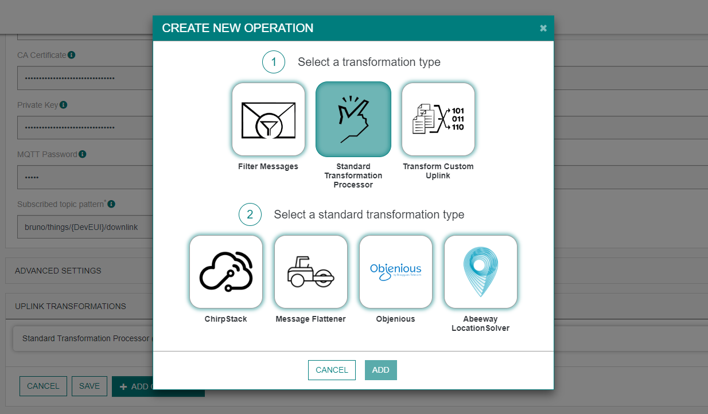

Documentation of the Resolved Position message could be found on <a href="https://dx-api.thingpark.io/location-connector/latest/doc/index.html#resolvedposition">ThingPark X Location Engine documentation</a>.

#### Customer filter processor
All connectors that support processors (uplink transformations) could now filter messages using a JSONata expression.
On "Uplink transformation" panel, add a new operation and select "Filter" and "Filter JSONata". 
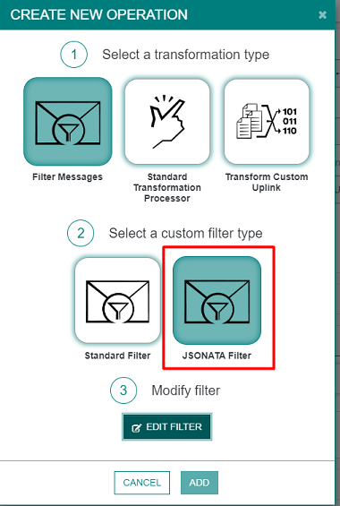

Select an example and a predefine filter, adapt it and test it, that all.
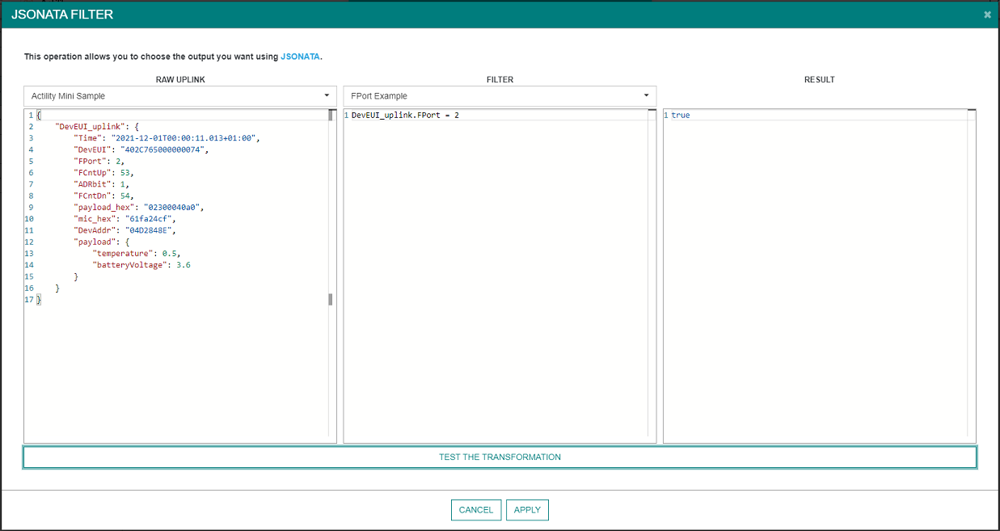

### MAJOR BUGS RESOLVED

| JIRA Ticket | Description |
| ----------- | ----------- |
| ```TXIF-2161``` | Thingboard connection stay on OPENING state when login failed. |
| ```TXIF-2160``` | MODBUS Issue when 1 of 2 rules failed . |
| ```TXIF-2122``` | Azure event hub issue when downlink topic doesn't exist. |
| ```TXIF-2030``` | Uplink Topic pattern - JSLT complex expression cannot be saved. |

## 1.7.6a

### MAJOR BUGS RESOLVED

| JIRA Ticket | Description |
| ----------- | ----------- |
| ```TXIF-2168``` | Reload of a connection don't work properly. |

## 1.7.6

### MAJOR BUGS RESOLVED

| JIRA Ticket | Description |
| ----------- | ----------- |
| ```TXIF-2114``` | Unable to start IoT-Flow after an update in case of high number of connections (&gt;250 per bridge). |
| ```TXIF-2112``` | IoT flow event message is confusing on closing state when deactivate a connection. |

## 1.7.4

### NEW FEATURES RELEASED
| JIRA Ticket | Description |
| ----------- | ----------- |
| ```TXIF-2106``` | MQTT Connector - Change placeholder of connection timeout and action timeout to defaut used. |
| ```TXIF-2098``` | Thingboard connector - Inject LoRaWan fields on output Message. |
| ```TXIF-2091``` | Add a part of random delay when a connector restart. More or less one minute. |
| ```TXIF-2078``` | HTTP Strict mode for automatic retry on server error. |
| ```TXIF-2079``` | HTTP Connector - Strict mode switch on Advanced panel. |
| ```TXIF-2074``` | Thingworx option "SendRawDecodedFormat" on Advanced panel. |
| ```TXIF-2042``` | Connection Kafka partition scale-up. |
| ```TXIF-2023``` | Thingworx QueryImplementingThings should be replaced by QueryImplementingThingsOptimized. |
| ```TXIF-1953``` | New messages: Device and BS Alarms Notification. |
| ```TXIF-1293``` | Chirpstack other messages implementation. |

### MAJOR BUGS RESOLVED

| JIRA Ticket | Description |
| ----------- | ----------- |
| ```TXIF-2096``` | WMW Connection timeout and action timeout should be set to 60000ms by default. |
| ```TXIF-2093``` | Uplink lost on Azure IoT Central for devices other than Abeeway. |
| ```TXIF-2085``` | Wrong datetime calculated for the next restart of a connection. |
| ```TXIF-2084``` | Thingworx should support derived template. |
| ```TXIF-2076``` | Slowness on startup for starting connections. |
| ```TXIF-2068``` | TPX-UI : Logo customization : Operator logo not used. |
| ```TXIF-2060``` | Transformation order is automatically changed. |
| ```TXIF-2058``` | Uplink transformation JMSPath &amp; JSLT not applied. |
| ```TXIF-2075``` | HTTP uplink/downlink counter seem's not working. |
| ```TXIF-2069``` | ThingBoard connection stay on Closing state. |
| ```TXIF-2066``` | HTTP Downlink doesn't work. |

## 1.7.3

### MAJOR BUGS RESOLVED

| JIRA Ticket | Description |
| ----------- | ----------- |
| ```TXIF-1910``` | Thingworx test behavior when ThingTemplateName change. |
| ```TXIF-2022``` | Azure IoT-Hub replay message on ACK failure. |
| ```TXIF-2052``` | Azure IoT-Hub too many reactors. |

## 1.7.2

### MAJOR BUGS RESOLVED

| JIRA Ticket | Description |
| ----------- | ----------- |
| ```TXIF-2040``` | HTTP LRC Compliance doesn't work anymore. |
| ```TXIF-2012``` | Fuota connection page: remove User Guide link and warning notification. |
| ```TXIF-2029``` | Connection status optimisation. |
| ```TXIF-2034``` | Dx-Core Swagger URL should be adapted. |
| ```TXIF-2036``` | Event menu should be hidden on OCP. |
| ```TXIF-2041``` | Fuota's information page is not implemented. |
| ```TXIF-2043``` | Filter connection list with a word that don't match. |
| ```TXIF-2003``` | Add filter on UI for hostname on Cumulocity connector. |

## 1.7.1a

### MAJOR BUGS RESOLVED

| JIRA Ticket | Description |
| ----------- | ----------- |
| ```TXIF-2063``` | Thingsboard timeout on login. |

## 1.7.1

### NEW FEATURES RELEASED

#### Google Cloud

This new connector enables devices to use the <a href="https://cloud.google.com/iot-core"> Google IoT Core</a>.

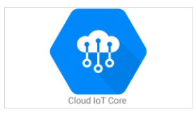

Documentation can be found on <a href="https://docs.thingpark.com/thingpark-x/latest/Connector/GOOGLE_IOT_CORE/">the ThingPark Connectors documentation</a>.

#### Kafka

This new connector enables sending uplinks to a Kafka Broker.


Documentation can be found on <a href="https://docs.thingpark.com/thingpark-x/latest/Connector/KAFKA/">the ThingPark Connectors documentation</a>.

#### Datacake

This new connector enables sending uplinks to <a href="https://docs.datacake.de/">Datacake</a>.


Documentation can be found on <a href="https://docs.thingpark.com/thingpark-x/latest/Connector/DATACAKE/">the ThingPark Connectors documentation</a>.

#### WMW

This new connector enables sending uplinks to <a href="https://clickgo.wmw-hub.com/">WMW</a>.


Documentation can be found on <a href="https://docs.thingpark.com/thingpark-x/latest/Connector/WMW/">the ThingPark Connectors documentation</a>.

#### Qubitro

This new connector enables sending uplinks to <a href="https://www.qubitro.com/">Qubitro</a>.


Documentation can be found on <a href="https://docs.thingpark.com/thingpark-x/latest/Connector/QUBITRO/">the ThingPark Connectors documentation</a>.

#### CommonSense

This new connector enables sending uplinks to <a href="https://www.vertical-m2m.com/">CommonSense</a>.


Documentation can be found on <a href="https://docs.thingpark.com/thingpark-x/latest/Connector/COMMONSENSE/">the ThingPark Connectors documentation</a>.

#### TagoIO

This new connector enables sending uplinks to <a href="https://tago.io/">TagoIO</a>.


Documentation can be found on <a href="https://docs.thingpark.com/thingpark-x/latest/Connector/TAGO/">the ThingPark Connectors documentation</a>.

#### Gear Studio

This new connector enables sending uplinks to <a href="https://gears.studio/">Gear Studio</a>.


Documentation can be found on <a href="https://docs.thingpark.com/thingpark-x/latest/Connector/GEAR_STUDIO/">the ThingPark Connectors documentation</a>.

#### Opinum

This new connector enables sending uplinks to <a href="https://www.opinum.com/en/">Opinum</a>.


Documentation can be found on <a href="https://docs.thingpark.com/thingpark-x/latest/Connector/OPINUM/">the ThingPark Connectors documentation</a>.

#### Cayenne

This new connector enables sending uplinks to <a href="https://mydevices.com/">Cayenne</a>.


Documentation can be found on <a href="https://docs.thingpark.com/thingpark-x/latest/Connector/CAYENNE/">the ThingPark Connectors documentation</a>.

### Updated connectors

#### Downlink endpoint for all connectors

All connectors now support downlinks using a dedicated endpoint.
Just a simple API REST call ```POST  https://community.thingpark.io/iot-flow/downlinkMessages/<downlinkuuid>``` with a <a href="https://docs.thingpark.com/thingpark-x/latest/Message/Downlink_Message/">Downlink message</a> as body.

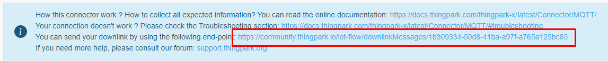

### Processors

#### Objenius format
On the *Uplink transformations* panel of your connection, you can now transform automatically Actility uplinks to Objenious uplinks format.

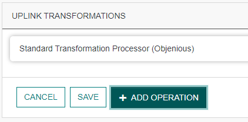 

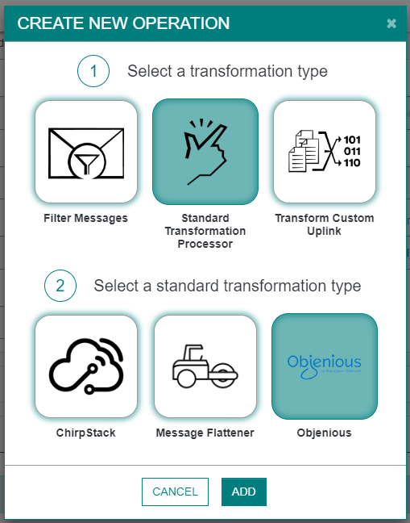 

*Example of generated Objenious uplink.*
``` json
{
  "id" : "5ea1eae2-84b7-4590-a794-390a7efb2629",
  "device_id" : "A81758FFFE06F23E",
  "profile" : "elsys:ers-co2:1",
  "type" : "uplink",
  "timestamp" : "2022-08-17T17:37:27.344+00:00",
  "count" : 390,
  "payload_cleartext" : "0100e7023204002805000601a2070e53",
  "payload" : {
    "temperature" : 23.1,
    "humidity" : 50,
    "light" : 40,
    "motion" : 0,
    "co2" : 418,
    "vdd" : 3667
  },
  "device_properties" : {
    "deveui" : "A81758FFFE06F23E"
  },
  "protocol_data" : {
    "DevAddr" : "04000E24",
    "NetID" : "10000958",
    "best_gateway_id" : "10000958",
    "gateways" : 3,
    "noise" : -57.0,
    "port" : 5,
    "requested_nbrep" : 1,
    "rssi" : -47.592655,
    "sf" : 7,
    "signal" : -47.762199,
    "snr" : 14.0
  }
}
```
#### JSLT Transformation
On the *Uplink transformations* panel of your connection, you can now use JSLT transformation to generate your own format.
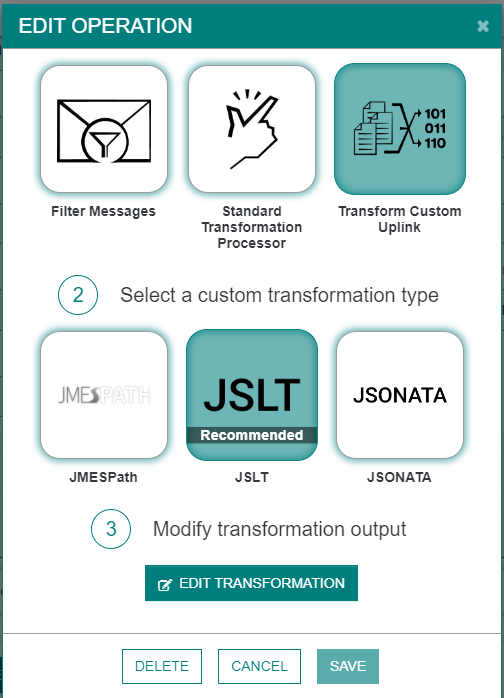

You can experiment your own transformer with a large set of messages.
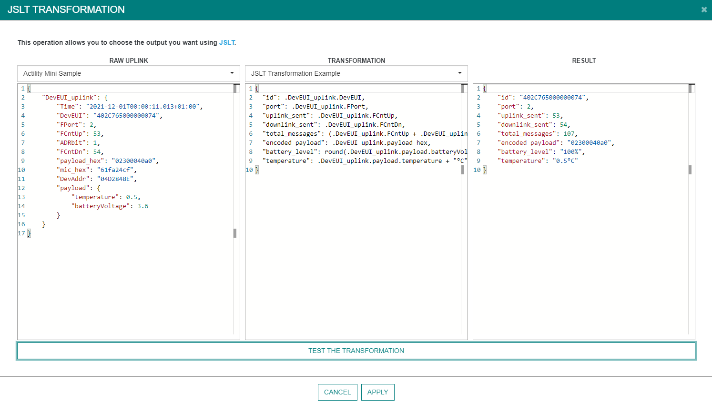 

Documentation can be found on <a href="https://docs.thingpark.com/thingpark-x/latest/Processor/JSLT/">the ThingPark Processor documentation</a>.

#### JSONata Transformation
On the *Uplink transformations* panel of your connection, you can now use JSONata transformation to generate your own format.
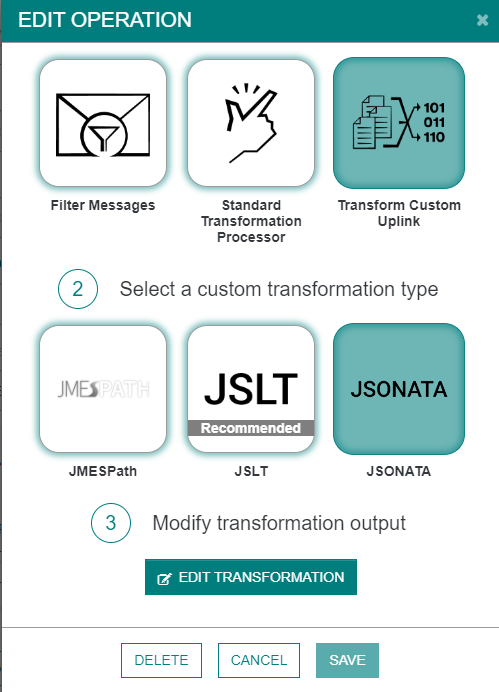

You can experiment your own transformer with a large set of messages.
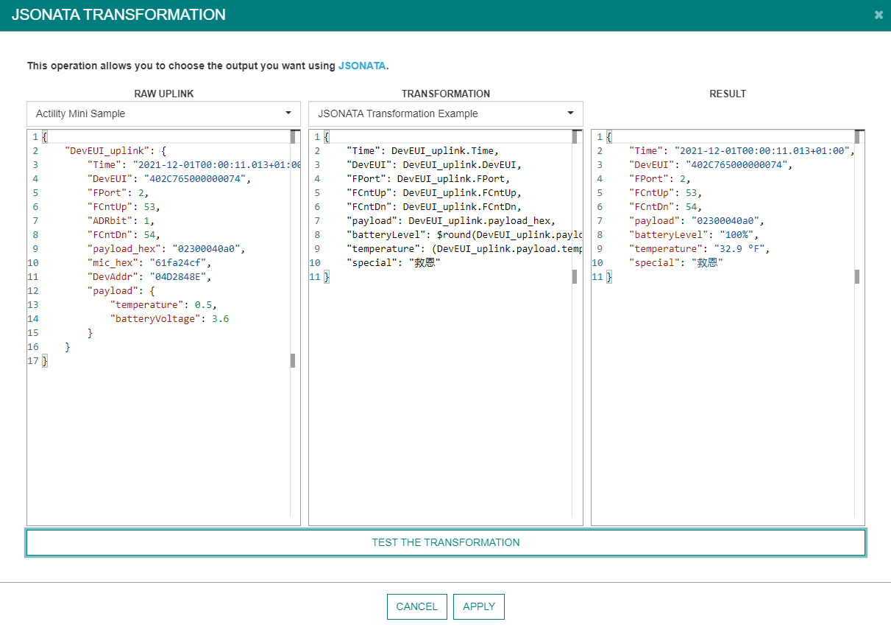 

Documentation can be found on <a href="https://docs.thingpark.com/thingpark-x/latest/Processor/JSONata/">the ThingPark Processor documentation</a>.

### NEW FEATURES RELEASED

| JIRA Ticket | Description |
| ----------- | ----------- |
| ```TXIF-1862``` | Proxy section is available on OCP only. |
| ```TXIF-1895``` | Add Forum link on all connectors for Community only. |
| ```TXIF-1591``` | CFT link is more visible on AWS Connector. |
| ```TXIF-1588``` | Adding a link to API Swagger-UI on left menu. |
| ```TXIF-1548``` | Driver UI refactoring. |
| ```TXIF-1984``` | Adding of driver examples. |
| ```TXIF-1929``` | Result of a decoded uplink could now contain fPort. |
| ```TXIF-1839``` | Search field on connection list. |
| ```TXIF-1909``` | New field ``Thing Template Name`` on Thingworx connector UI. |
| ```TXIF-1914``` | New field ``uplinkTimeValidity`` on each connector UI (Advanced panel). |
| ```TXIF-1919``` | On *Send Downlink* panel of each connector, DeviceEUI could now include dash. (Eg: 74-FE-48-FF-FF-5A-3D-9F) |
| ```TXIF-1884``` | Driver list pagination. |

### MAJOR BUGS RESOLVED

| JIRA Ticket | Description |
| ----------- | ----------- |
| ```TXIF-1930``` | Unable to update Flow name with lowercases. |
| ```TXIF-1954``` | Error when decoding driver examples. |
