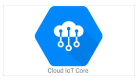
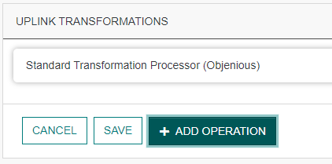
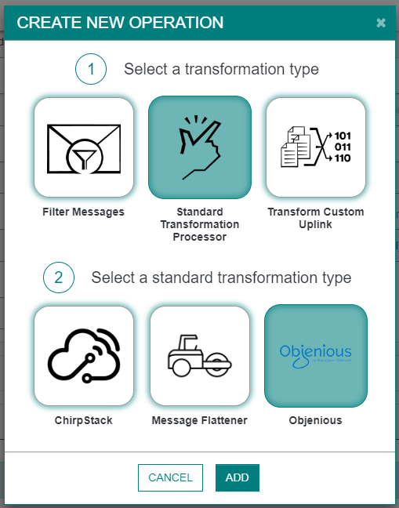
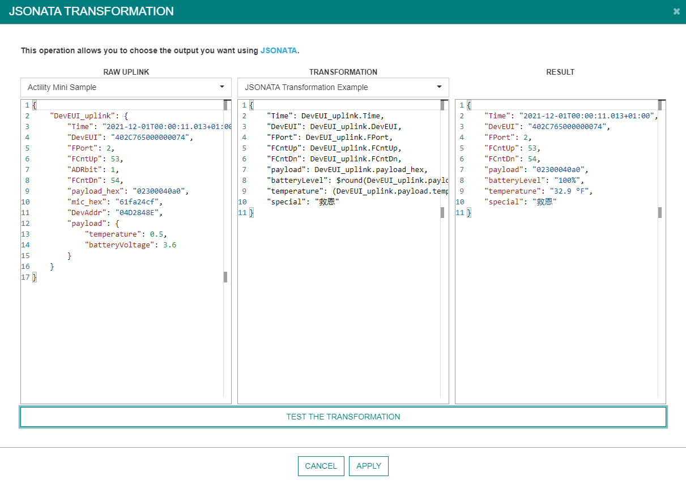

# TPX-IoT-Flow 1.7.X

## 1.7.1

### NEW FEATURES RELEASED

#### Google Cloud

This new connector enables devices to use the <a href="https://cloud.google.com/iot-core" style="color:teal"> Google IoT Core</a>.



Documentation can be found on <a href="https://docs.thingpark.com/thingpark-x/latest/Connector/GOOGLE_IOT_CORE/" style="color:teal">the ThingPark Connectors documentation</a>.

#### Kafka

This new connector enables sending uplinks to a Kafka Broker.


Documentation can be found on <a href="https://docs.thingpark.com/thingpark-x/latest/Connector/KAFKA/" style="color:teal">the ThingPark Connectors documentation</a>.

#### Datacake

This new connector enables sending uplinks to <a href="https://docs.datacake.de/" style="color:teal">Datacake</a>.


Documentation can be found on <a href="https://docs.thingpark.com/thingpark-x/latest/Connector/DATACAKE/" style="color:teal">the ThingPark Connectors documentation</a>.

#### WMW

This new connector enables sending uplinks to <a href="https://clickgo.wmw-hub.com/" style="color:teal">WMW</a>.


Documentation can be found on <a href="https://docs.thingpark.com/thingpark-x/latest/Connector/WMW/" style="color:teal">the ThingPark Connectors documentation</a>.

#### Qubitro

This new connector enables sending uplinks to <a href="https://www.qubitro.com/" style="color:teal">Qubitro</a>.


Documentation can be found on <a href="https://docs.thingpark.com/thingpark-x/latest/Connector/QUBITRO/" style="color:teal">the ThingPark Connectors documentation</a>.

#### CommonSense

This new connector enables sending uplinks to <a href="https://www.vertical-m2m.com/" style="color:teal">CommonSense</a>.


Documentation can be found on <a href="https://docs.thingpark.com/thingpark-x/latest/Connector/COMMONSENSE/" style="color:teal">the ThingPark Connectors documentation</a>.

#### TagoIO

This new connector enables sending uplinks to <a href="https://tago.io/" style="color:teal">TagoIO</a>.


Documentation can be found on <a href="https://docs.thingpark.com/thingpark-x/latest/Connector/TAGO/" style="color:teal">the ThingPark Connectors documentation</a>.

#### Gear Studio

This new connector enables sending uplinks to <a href="https://gears.studio/" style="color:teal">Gear Studio</a>.


Documentation can be found on <a href="https://docs.thingpark.com/thingpark-x/latest/Connector/GEAR_STUDIO/" style="color:teal">the ThingPark Connectors documentation</a>.

#### Opinum

This new connector enables sending uplinks to <a href="https://www.opinum.com/en/" style="color:teal">Opinum</a>.


Documentation can be found on <a href="https://docs.thingpark.com/thingpark-x/latest/Connector/OPINUM/" style="color:teal">the ThingPark Connectors documentation</a>.

#### Cayenne

This new connector enables sending uplinks to <a href="https://mydevices.com/" style="color:teal">Cayenne</a>.


Documentation can be found on <a href="https://docs.thingpark.com/thingpark-x/latest/Connector/CAYENNE/" style="color:teal">the ThingPark Connectors documentation</a>.

### Updated connectors

#### Downlink endpoint for all connectors

All connectors now support downlinks using a dedicated endpoint.
Just a simple API REST call 'POST  https://community.thingpark.io/iot-flow/downlinkMessages/<DownlinkUUID>' with a <a href="https://docs.thingpark.com/thingpark-x/latest/Message/Downlink_Message/" style="color:teal">Downlink message</a> as body.


### Processors

#### Objenius format
On the *Uplink transformations* panel of your connection, you can now transform automatically Actility uplinks to Objenious uplinks format.

 

 

*Example of generated Objenious uplink.*
``` json
{
  "id" : "5ea1eae2-84b7-4590-a794-390a7efb2629",
  "device_id" : "A81758FFFE06F23E",
  "profile" : "elsys:ers-co2:1",
  "type" : "uplink",
  "timestamp" : "2022-08-17T17:37:27.344+00:00",
  "count" : 390,
  "payload_cleartext" : "0100e7023204002805000601a2070e53",
  "payload" : {
    "temperature" : 23.1,
    "humidity" : 50,
    "light" : 40,
    "motion" : 0,
    "co2" : 418,
    "vdd" : 3667
  },
  "device_properties" : {
    "deveui" : "A81758FFFE06F23E"
  },
  "protocol_data" : {
    "DevAddr" : "04000E24",
    "NetID" : "10000958",
    "best_gateway_id" : "10000958",
    "gateways" : 3,
    "noise" : -57.0,
    "port" : 5,
    "requested_nbrep" : 1,
    "rssi" : -47.592655,
    "sf" : 7,
    "signal" : -47.762199,
    "snr" : 14.0
  }
}
```
#### JSLT Transformation
On the *Uplink transformations* panel of your connection, you can now use JSLT transformation to generate your own format.


You can experiment your own transformer with a large set of messages.
 

Documentation can be found on <a href="https://docs.thingpark.com/thingpark-x/latest/Processor/JSLT/" style="color:teal">the ThingPark Processor documentation</a>.

#### JSONata Transformation
On the *Uplink transformations* panel of your connection, you can now use JSONata transformation to generate your own format.


You can experiment your own transformer with a large set of messages.
 

Documentation can be found on <a href="https://docs.thingpark.com/thingpark-x/latest/Processor/JSONata/" style="color:teal">the ThingPark Processor documentation</a>.

### NEW FEATURES RELEASED

| JIRA Ticket | Description |
| ----------- | ----------- |
| ```TXIF-1862``` | Proxy section is available on OCP only. |
| ```TXIF-1895``` | Add Forum link on all connectors for Community only. |
| ```TXIF-1591``` | CFT link is more visible on AWS Connector. |
| ```TXIF-1588``` | Adding a link to API Swagger-UI on left menu. |
| ```TXIF-1548``` | Driver UI refactoring. |
| ```TXIF-1984``` | Adding of driver examples. |
| ```TXIF-1929``` | Result of a decoded uplink could now contain fPort. |
| ```TXIF-1839``` | Search field on connection list. |
| ```TXIF-1909``` | New field ``Thing Template Name`` on Thingworx connector UI. |
| ```TXIF-1914``` | New field ``uplinkTimeValidity`` on each connector UI (Advanced panel). |
| ```TXIF-1919``` | On *Send Downlink* panel of each connector, DeviceEUI could now include dash. (Eg: 74-FE-48-FF-FF-5A-3D-9F) |
| ```TXIF-1884``` | Driver list pagination. |

### MAJOR BUGS RESOLVED

| JIRA Ticket | Description |
| ----------- | ----------- |
| ```TXIF-1930``` | Unable to update Flow name with lowercases. |
| ```TXIF-1954``` | Error when decoding driver examples. |